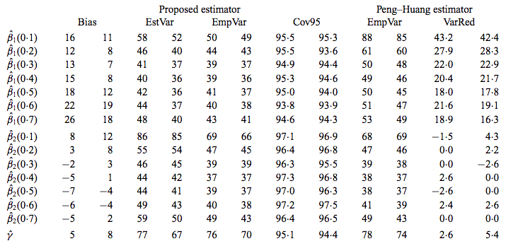
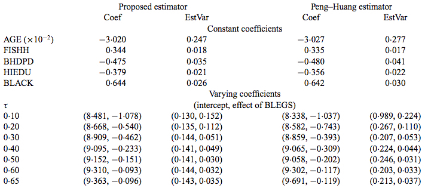
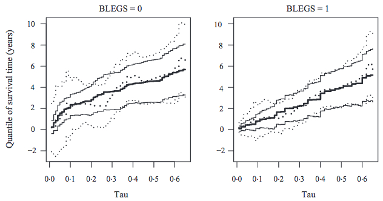

### Overall Purpose

- Quantile regression offers flexibility in assessing covariate effects on event times.
- Develop quantile regression approach for survival subject to conditionally independent censoring.
- Tailor regression to partially functional effect setting. (Both varying and constant effects) 
- Martingale based estimating equations lead to single algorithm that involves minimizing L1-type convex functions.
- Establish properties of estimators.

## Background on quantile regression

- Each covariate effect varies by quantile.
- For event time of interest $Y$ and covariate vector $W$, a quantile regression model assumes the $\tau$th quantile of $Y$ is given by:

$$
\begin{aligned}
Q_{Y}(\tau)&= F^{-1}_{Y}(\tau)\equiv \inf \{y: F_{Y}(y)\geq \tau\}, \quad \tau\in(0,1) \\
Q_{Y}(\tau|W)&= W^{T}\beta(\tau)
\end{aligned}
$$

- $Q_{Y}(\tau|W) \equiv inf{y: pr(Y \leq y | W) \geq \tau}$ denotes $\tau$th conditional quantile of $Y$ given $W$.
- Describes linear relationship between $W$ and $\tau$th quantile.
- Quantile function is minimum value of time $T$ below which subject will fall $p\times 100$ percent of times.

## Partially functional effects
- $\beta(\tau)$ represents effect of $W$ on $Q_{Y}(\tau|W)$
- Coefficients for $W$ are allowed to be function of $\tau$ meaning they are allowed to be related to both shape and location of distribution, not just a measure of central tendency.
- Partially Functional Effects:
    - A model which includes a mixture of constant and varying effects.
    - $\tau$-varying coefficients correspond to effects allowed to vary by quantile group. 
- May be preferred to fully functional model due to more accurate quantile prediction for small $\tau$

## Censored quantile regression
Let $T$ and $C$ denote survival and censoring time.

$X = \min(T,C)$ and $\delta = I(T \leq C)$ where $I(\cdot)$ is indicator function.

$Y = \log T$

Partition $W$ into constant and quantile-varying effects
$$
W=(Z^{T}, V^{T})^{T}
$$

$Z$ is $p\times 1$ vector of $\tau$-varying effects.

$V$ is $q\times 1$ vector of constant effects.

Data: $\{(X_{i}, \delta_{i}, Z_{i}, V_{i}),\quad i=1,...,n\}$

\textbf{Reminder:}

(a) CDF: $F_{T}(t|Z,V)= \Pr(T \leq t|Z,V)$
(b) Survival Function: $S(t)= Pr(T\geq t|Z,V) = 1-F_{T}(t|Z,V)$
(c) Cumulative Hazard Function: $\Lambda(t)= -\log S(t)= -\log (1-F_{T}(t|Z,V))$

## Partially functional quantile regression model

$$
Q_{Y}(\tau|Z,V) = Z^{T}\beta(\tau) + V^{T}\gamma, \quad \tau \in (0,1)
$$

- How do we account for the censoring?
- Monotone profile estimating equation!

## Martingale process
- To estimate $\beta(\tau)$, idea is to use stochastic property of the Martingale process. 
- One jump counting process: gives information about when events occur. i.e. If person $i$ is "failure" by time $t$.
$$
N_{i}(t)= I(X_{i}\leq t, \delta_{i}=1)
$$

- Indicator if survival/censored time is above/equal to $t$
$$
Y_{i}(t)= I(X_{i}\geq t)
$$

- Martingale counting process wrt $F_{t}$, given by $M(t)= N(t)-\Lambda(t)$
$$M(t) = N(t) -\int_{0}^{t} Y(s)d\Lambda_{T}(s|Z,V)$$

- Non-decreasing step function minus a compensator (Cumulative Hazard Function)

- Mean-zero white noise
$$
E[M(t)|V,Z]=0
$$
    

## Estimating equation (Peng \& Huang, 2008)

- Approach for random censoring is to extend the Martingale representation of the Nelson-Aalen estimator of the cumulative hazard to produce an estimating equation.
- Aim: to get $\beta$ and $\gamma$. 

- NA estimator: non-parametric estimator of the cumulative hazard rate function in case of censored data given by 
$$\tilde{H}(t)= \sum_{t_i \leq t}\frac{d_i}{n_i}$$
\noindent
with $d_i$ denoting the number of events at $t_i$ and $n_i$ as the total number at risk at $t_i$. 

## The Estimating equation
$$
\begin{split}
    \text{E} \Bigg [ n^{-1/2}\sum_{i=1}^{n}\omega_{i} \bigg (N_{i} \exp \{Z_{i}^{T} \beta_{0} (\tau) + V_{i}^{T}\gamma_{0}\} \\ - \int_{0}^{\tau} I \Big [X_{i} \geq \exp \{Z_{i}^{T} \beta_{0} (u) + V_{i}^{T}\gamma_{0}\} \Big ] dH(u) \bigg ) \Bigg ] \\ = 0
\end{split}
$$

- $\beta_{0}$ and $\gamma_{0}$ are true values of $\beta$ and $\gamma$.
- Counting process = its compensator $= \Lambda_{i}[\exp \{Z_{i}^{T} \beta_{0} (\tau) + V_{i}^{T} \gamma_{0} \}]$

## Computing Algorithm
1) Get $\widehat{\beta}(\tau_{j}, \gamma)$ with $\gamma$ fixed.

$$
\begin{split}
n^{-1} \sum_{i=1}^{n} Z_{i} \Bigg ( N_{i} \exp \{Z_{i}^{T} \beta(\tau_{j}) + V_{i}^{T}\gamma\} \\ -
\sum_{k=0}^{j-1} I \bigg [X_{i} \geq \exp \{Z_{i}^{T} \widehat{\beta} (\tau_k, \gamma) + V_{i}^{T} \gamma)\} \bigg ] \Big ( H(\tau_{k+1}) - H(\tau_k) \Big) \Bigg) \\
=0
\end{split}
$$

Solve for $\beta(\tau_j)$

## Computing Algorithm 
2) Get $\widehat{\gamma}$ with $\widehat{\beta}(\tau_j)$ fixed.
$$
\begin{split}
n^{-1} \sum_{i=1}^{n} V_{i} \Bigg( N_{i} \exp \{ Z_{i}^{T} \widehat{\beta}(\tau_{U},\gamma) + V_{i}^{T} \gamma \} \\ -
\sum_{k=0}^{L-1} I \bigg [X_{i} \geq \exp \{Z_{i}^{T} \widehat{\beta} (\tau_k, \gamma) + V_{i}^{T} \gamma \} \bigg ] \Big (H(\tau_{k+1})-H(\tau_k ) \Big) \Bigg ) \\
=0
\end{split}
$$

Solve for $\gamma$

3) ...

Iterate until convergence criteria is met.

## L1-type Optimization
- Finds roots of equations via optimization techniques
- Easy to implement optimization in R software to get $\widehat{\beta}$ and $\widehat{\gamma}$ that minimizes objective function.
1) Set $m=0$ and choose initial $\widehat{\gamma}^{m}$
2) Find $\widehat{\beta}^{(m)}(\tau_j, \widehat{\gamma}^{(m)})$
$$
\begin{split}
l_j (h) = \sum_{i=1}^n \left | \delta_i \left (\log X_i - V_i^T \widehat{\gamma}^{(m)} - Z_i^T h \right ) \right | + \left | R^* - \sum_{l=1}^n \left (- \delta_l Z_l^T h \right ) \right | \\ + \Bigg | R^* - \sum_{r=1}^n \Bigg ( 2 Z_r^T h \sum_{k=0}^{j-1} I \left [ X_r \geq \exp \left \{ Z_i^T \widehat{\beta}^{(m)}(\tau_k,\widehat{\gamma}^{(m)}) + V_i^T \widehat{\gamma}^{(m)} \right \} \right ] \\ \left \{ H(\tau_{k+1}) - H(\tau_k) \right \} \Bigg ) \Bigg | 
\end{split}
$$

##
3) Find $\widehat{\gamma}^{(m+1)}$ given estimate for $\widehat\beta^{(m)}(\cdot,\widehat\gamma^{(m)})$ from step 2.
$$
\begin{split}
l^{*}(h) = \sum_{i=1}^{n} \left |\delta_i \{ \log X_i - Z_{i}^{T} \widehat{\beta}^{(m)}(\tau_U,\widehat\gamma^{(m)}) - V_{i}^{T} h \} \right | \\ + \left | R^{*} - \sum_{l=1}^{n} (-\delta_{l} V_{l}^{T} h) \right | \\ + \sum_{k=0}^{L-1} \Bigg [ \sum_{i=1}^{n} \bigg | \{ \log X_i - Z_{i}^{T} \widehat{\beta}^{(m)}(\tau_U,\widehat\gamma^{(m)}) - V_i^T h \} \\ \{ H (\tau_{k+1}) - H (\tau_k) \} \bigg | \\ + \left | R^{*} - \sum_{r=1}^{n} (-V_{r}^{T} h) \{ H (\tau_{k+1}) - H (\tau_k) \} \right | \Bigg ] + \left | R^{*} - \sum_{s=1}^{n} 2 V_{s}^{T} h H (\tau_L ) \right |
\end{split}
$$

4) Update $m$ to $m+1$ and repeat steps 2-3 until convergence criteria met.

## Asymptotic Properties

- Theorem 1:  Shows consistency for $\widehat\gamma$, as $n\rightarrow \infty$, and uniformly consistent for $\widehat\beta$, so estimates converge to the truth.
$$
\begin{aligned}
\widehat{\gamma}&\rightarrow \gamma_0 \mbox { in probability } \\
\sup_\tau||\widehat{\beta}(\tau)-\beta_0 (\tau)||&\rightarrow 0 \mbox{ in probability }
\end{aligned}
$$

- Theorem 2: Asymptotic Distributions
$$
\begin{aligned}
n^{1/2}(\widehat{\gamma} - \gamma_0 )&\sim^{\mathrm{asymp}}N(0, E[...]) \\
n^{1/2}(\widehat{\beta}(\tau)- \beta_0(\tau))&\rightarrow GT(\tau)
\end{aligned}
$$
- Generalization of asymptotic normality for parameter that is a function of $\tau$. 

## Resampling-based inference procedure

- The limit distributions of $\sqrt{n}(\widehat{\gamma}-\gamma_0)$ and $\sqrt{n}(\widehat{\beta}(\tau)-\beta_0(\tau))$ involve unknown density functions
- The estimation of these distributions may not be stable with a small or moderate sample size
- The authors proposed a new resampling approach similar to that of wild bootstrapping

## Resampling-based inference procedure

1) Draw $n$ idd nonnegative variates of a known distribution with a mean and variance of 1, e.g.:
$$
\zeta_i \sim \exp(1)
$$
2) Solve estimating equations on slides 12 and 13 perturbed by $\zeta_i$
$$
\begin{split}
\tilde{l}_{j}(h) = \sum_{i=1}^n \left | \zeta_i \delta_i \left ( \log X_i - V_i^T \gamma^{*(m)} - Z_i^{T}h \right ) \right | \\ + \left | R^{*} - \sum_{l=1}^{n} \left ( -\zeta_l \delta_l Z_l^T h \right ) \right | + \Bigg | R^* \\ - \sum_{r=1}^n \Bigg ( 2 \zeta_i Z_r^T h \sum_{k=0}^{j-1} I \left [ X_r \geq \exp{Z_{i}^{T} \beta^{*(m)}(\tau_k,\gamma^{*(m)}) + V_i^T \gamma^{*(m)}} \right ] \\ \left \{ H(\tau_{k+1}) - H(\tau_k) \right \} \Bigg ) \Bigg | 
\end{split}
$$

##

2) (continued)
$$
\begin{split}
\tilde{l}^*(h) = \sum_{i=1}^n \left | \zeta_i \delta_i \left \{ \log X_i - Z_i^T \beta^{*(m)}(\tau_U,\gamma^{*(m)}) - V_i^T h \right \} \right | \\ + \left | R^* - \sum_{l=1}^n \left ( - \zeta_l \delta_lV_l^T h \right ) \right | \\ + \sum_{k=0}^{L-1} \Bigg [ \sum_{i=1}^n \bigg | \zeta_i \left \{ \log X_i - Z_i^T \beta^{*(m)}(\tau_k,\gamma^{*(m)}) - V_i^T h  \right \} \\ \big \{ H (\tau_{k+1}) - H (\tau_k) \big \} \bigg | \\ + \left | R^{*} - \sum_{r=1}^{n} (-\zeta_r V_{r}^{T} h) \left \{ H (\tau_{k+1}) - H (\tau_k ) \right \} \right | \Bigg ] \\ + \left | R^{*} - \sum_{s=1}^{n} 2 \zeta_s V_{s}^{T} h H ( \tau_L ) \right |
\end{split}
$$
3) Repeat $K$ times

## Resampling-based inference procedure

- The variance of $\widehat{\beta}(\tau)$ and $\widehat{\gamma}$ can be estimated by the sample variance of $\{\beta_k^*(\tau)\}^K_{k=1}$ and $\{\gamma^*\}^K_{k=1}$
- A confidence intervals can be constructed using normal approximations or by using the empirical percentiles
- The conditional variance and covariance of the resampled estimating equations converge to the unconditional variance and covariance of the original estimating equations
- The conditional distribution of $n^{1/2} (\gamma^* - \widehat{\gamma})$ converges to the unconditional distribution of $n^{1/2} (\widehat{\gamma} - \gamma_0)$, same for $\beta^* (\tau), \widehat{\beta} (\tau), \beta_0 (\tau)$
- Has better numerical performance than a nonparametric bootstrap

## Simulation study: overview

Simulations were conducted to assess the finite-sample performace of the proposed method versus the Peng-Huang estimator in the following metrics:

- bias
- variance
- the impact of varying the following parameters on estimator efficiency:
    - sample size
    - number of covariates
    - dependency among covariates
    - censoring proportion
    - error heteroscedasticity

## Simulation study: setup

Four simulation schemes were used, but we'll just look at the two in the main paper.
Event times were generated from a log-linear model with iid errors:
$$
\begin{aligned}
    \log T (\text{I}) &= b_1 V_1 + b_2 V_2 + \epsilon \\
    \log T (\text{II}) &= b_1 V_1 + b_2 \xi Z_1 + \epsilon \\
    V_1 &\sim \text{Uniform}(0,1) \\
    V_2,Z_1 &\sim \text{Bernoulli}(0.5) \\
    \xi &\sim \exp(1) \\
    \{b_1&: 0,0.5\} \\
    b_2 &= -0.5 \\
\end{aligned}
$$
For each scenario, 1000 datasets were created with varying sample sizes ($n=100,\mathbf{200},400,800$).
When resampling is used, $K=250$ and $\zeta\sim\exp(1)$.
There are also censoring parameters that are not listed here.

## Simulation study: regression model
For scenario I:
$$
\begin{aligned}
    Q_{Y}(\tau|Z,V) &= Z^{T}\beta(\tau) + V^{T}\gamma, \quad \tau \in (0,1) \\
    Z &= 1 \\
    \beta_0(\tau) &= Q_\epsilon(\tau) \\
    V &= (V_1,V_2)^T \\
    \gamma_0 \equiv (\gamma_{01},\gamma_{02})^T &= (b_1,b_2)^T
\end{aligned}
$$

For scenario II:
$$
\begin{aligned}
    Q_{Y}(\tau|Z,V) &= Z^{T}\beta(\tau) + V^{T}\gamma, \quad \tau \in (0,1) \\
    Z &= (1,Z_1)^T \\
    \beta_0(\tau) &= \{\beta_{01}(\tau), \beta_{02}(\tau)\}^T \\
    V &= V_1 \\
    \gamma_0 &= b_1
\end{aligned}
$$

## Simulation study: bias and variance (I)

## Simulation study: bias and variance (II)

## Simulation study: impact of varying parameters

- Sample size
    - proposed estimator is root $n$ convergent, like Peng-Huang
- Number of covariates
    - With more covariates, the variance reduction relative to the Peng-Huang estimator decreases
- Dependency among covariates
    - Dependent covariates are associated with a slight increase in variance reduction in $\gamma$ and decreases in relative efficiency of $\beta$, especially at small values of $\tau$
- Censoring proportion
    - More censoring is associated slight decreases in constant coefficient efficiency and no effect on functional coefficients
- Error heteroscedasticity
    - Variance reduction shifts from intercept estimation to functional and constant coefficients

## Case study: renal disease

- A prospective study to investigate the risk factors in a cohort of 191 incident dialysis patients recruited from 26 facilities
- 35% of survival times censored due to renal transplant or the end of the study
- Covariates:
    - Patient age
    - Fish consumption in first year of dialysis (1 if any, 0 o.w.)
    - Baseline dialysis modality (1 if hemodialysis, 0 o.w.)
    - Education level (1 if high school or higher, 0 o.w.)
    - Race (1 if black, 0 o.w.)
    - Severe restless leg symptoms (1 if present, 0 o.w.)

## Case study: results

## Case study: results

