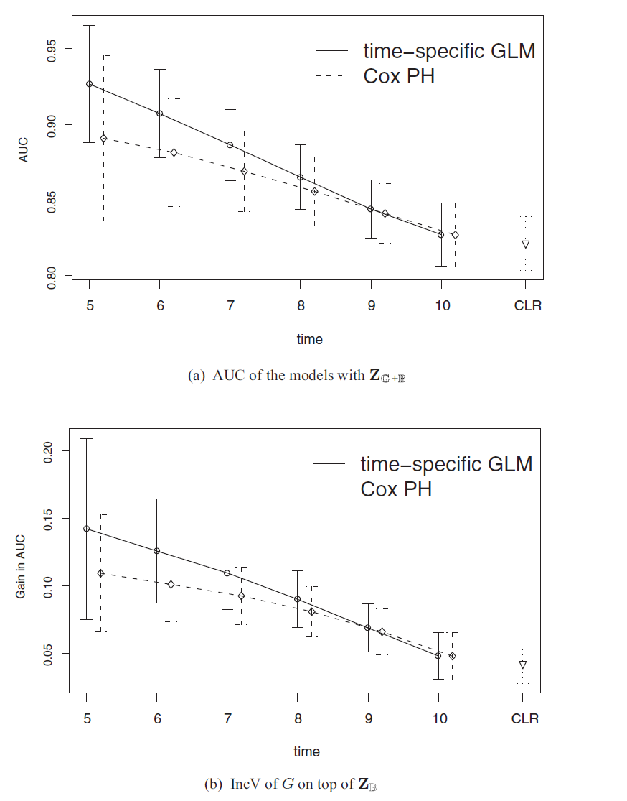

## Contents

- Study Design
- Challenges
    - Sampling
    - Time-varying effects
    - Evaluation
- Solutions
    - Sampling
    - Time-varying effects
    - Evaluation
- Results
- Simulation (if time)

## Study Design

- 121,700 US female registered nurses aged 30-55 enrolled in 1976
- 32,826 contributed blood
- 146 contracted RA between 1989/90 and 2004

## Study Design

- 126 RA patients had blood drawn in 1989/90
- 337 controls matched on clinical/bloodwork covariates
- 122 cases and 123 controls (randomly sampled from 337) had blood genotyped in 2004

## Study Design

- $T^\dagger$ indicates time from blood draw to disease onset
- Data from prior to 1989 not used
- $C$ is right-censored time, unclear if always 2004 or not

## Study Design: Covariates of Interest

- Clinical covariates (taken at time of blood draw)
    - Age
    - Smoking (in pack-years)
    - Alcohol (cumulative intake)
- Blood sample biomarkers (regarding inflammation)
    - IL-6
    - sTNFRII
- Genetic data
    - 39 SNPs identified with RA risks

## Challenges: Sampling

- Not simple random sample due to matching
    - Needs to be accounted for in risk model
- Further difficulties due to protection of some individuals

## Challenges: Time-varying effects

- Certain biomarkers have strong correlation at short-term predictions, but not long-term predictions
    - Most survival models ignore this and consider biomarkers time-invariant
- Also, there are a large number of covariates relative to the subcohort size

## Challenges: Evaluation

- ROC method not available for study designs that are all of the following:
    - Multi-phase
    - Time-dependent
    - Multivariate
    - Accounting for outcome-dependent sampling
- Need incremental value (IncV) metric for models with and without markers of interest
    - Didn't exist for 3-phase studies
    - Sequential finite population sampling induces complex correlation between observations
    
## Solutions: Sampling

- Notation?

## Solutions: Sampling

- summary and/or equations

## Solutions: Time-varying effects

## Solutions: Time-varying effects

## Solutions: Evaluation (ROC)

## Solutions: Evaluation (IncV)

## Results: Time-varying effects

## Results: ROC

## Commonly used accurancy measures for markers-1

Denote $\mathbb{F}$ the generic $t_0$-year risk estimate from fitting some model mentioned above.

To predict the association of  $t_0$-year RA risk with $\mathbb{F}$: 

- Positive predictive values (PPV): $PPV^{\mathbb{F}}_{t_0}(c)=P(T^{\dagger}\le t_0| \mathbb{F}>c)$

- Negative predictive values (NPV): $NPV^{\mathbb{F}}_{t_0}(c)=P(T^{\dagger}> t_0| \mathbb{F}\le c)$

- True positive rate (TPR): $TPR^{\mathbb{F}}_{t_0}(c)=P(\mathbb{F}>c |T^{\dagger}\le t_0 )$

- False positive rate (FPR): $FPR^{\mathbb{F}}_{t_0}(c)=P(\mathbb{F}>c |T^{\dagger}> t_0 )$

- ROC  curve: $ROC^{\mathbb{F}}_{t_0}(u)=TPR^{\mathbb{F}}_{t_0}\{FPR^{\mathbb{F}^{-1}}_{t_0}(u)\}$

- Area under ROC curve (AUC): $AUC^{\mathbb{F}}_{t_0}=\int_{0}^{1}ROC^{\mathbb{F}}_{t_0}(u)du$

## Commonly used accurancy measures for markers-2

- Incremental Value (IncV) of new markers:$\boldsymbol{B}$ on top of existing markers-$\boldsymbol{Z}$ of two risk models-$m_1$ with $\boldsymbol{B}+\boldsymbol{Z}$ and $m_2$ with $\boldsymbol{Z}$ only, then IncV of $\boldsymbol{B}$ can be quantified as:
\[
\mathbb{I}_{\mathbb{D}}^{m_1/m_2}=\mathbb{D}^{\mathbb{F}_{m_1}}-\mathbb{D}^{\mathbb{F}_{m_2}}
\]
where $\mathbb{F}_{m}$ dentoes the risk score for model $m$ and $\mathbb{D}^{\mathbb{F}_{m}}$ denotes the accuracy of the risk score $\mathbb{F}_{m}$ for $m\in\{m_1,m_2\}$.

- For example, the IncV of $\boldsymbol{B}+\boldsymbol{G}$ on top of existing markers-$\boldsymbol{Z}$ in $AUC$ is defined as $\mathbb{I}_{AUC}^{\boldsymbol{B}+\boldsymbol{G}/\boldsymbol{Z}} =AUC^{\mathbb{F}_{\boldsymbol{B}+\boldsymbol{G}}}-AUC^{\mathbb{F}_{\boldsymbol{Z}}}$

##Estimation and Inference Procedure for Prediction Accuracy and IncV

DIPW estimators are proposed above to account for the addiontal complexity due to three-phase sampling and multiple markers

The IncV $\mathbb{I}_{AUC}^{m_1/m_2}$ can be estimated by $\hat{\mathbb{I}}_{AUC}^{m_1/m_2}= \widehat{AUC}^{\hat{\mathbb{F}}_{m_1}}(c)-\widehat{AUC}^{\hat{\mathbb{F}}_{m_1}}(c)$, where
\[
\widehat{AUC}^{\hat{\mathbb{F}}_{m}}(c)=\frac{\sum_{i=1}^{n}\sum_{j=1}^{n}\hat{\omega}_i^m\hat{\bar{\omega}}_{t_0i}^{C}\hat{\omega}_j^m\hat{\bar{\omega}}_{t_0j}^{C}I\{\hat{\mathbb{F}}_{m_i}>\hat{\mathbb{F}}_{m_j},T_i\le t_0,T_j>t_0\}}{\sum_{i=1}^{n}\sum_{j=1}^{n}\hat{\omega}_i^m\hat{\bar{\omega}}_{t_0i}^{C}\hat{\omega}_j^m\hat{\bar{\omega}}_{t_0j}^{C}I\{T_i\le t_0,T_j>t_0\}}
\]
for $m\in \{m_1,m_2\}$, and $\hat{\omega}_i^{m}=\hat{\omega}_i^{\mathbb{G}}$ for models that include $\boldsymbol{G}$, $\hat{\omega}_i^{m}=\hat{\omega}_i^{\mathbb{B}}$ for models that involve $\boldsymbol{B}$ not $\boldsymbol{G}$, $\hat{\omega}_i^{m}=1$ for models that involve only $\boldsymbol{Z}$.

## Result 1-Evaluating RA Risk Models and IncV of Novel Markers with NHS RA Data

The clinical models have very low discriminatory capacity.

- $AUC$ of time-specific GLMs with $\boldsymbol{Z}$ are 0.53($95\%$ CI: [0.42, 0.64]) for predicting 5-year RA risk

- $AUC$ of time-specific GLMs with $\boldsymbol{Z}$ are 0.58($95\%$ CI: [0.53, 0.63]) for predicting 15-year RA risk

- $AUC$ of time-specific GLMs with $\boldsymbol{Z}_{\mathbb{G}+\mathbb{B}}$ are 0.70($95\%$ CI: [0.62, 0.79]) for predicting 5-year RA risk

- $AUC$ of time-specific GLMs with $\boldsymbol{Z}_{\mathbb{G}+\mathbb{B}}$ are 0.62($95\%$ CI: [0.55, 0.69]) for predicting 15-year RA risk

##Result 2.1-The estimates of the IncV by adding $\boldsymbol{B}$ and $\boldsymbol{G}$ in $AUC$ and $TPR$

Add $\boldsymbol{B}$ and $\boldsymbol{G}$ on top of $\boldsymbol{Z}$ with respect to $AUC_{t_0}, TPR_{t_0}, PPV_{t_0}$ and $NPV_{t_0}$ at the cutoff values to achieve $FPR_{t_0}=0.1$ for $t_0=5,6,8,10,12,14,15$ 
Solid,dash lines represents time-specific GLMs and PH models respectively.

##Result 2.2-The estimates of the IncV by adding $\boldsymbol{B}$ and $\boldsymbol{G}$ in $PPV$ and $NPV$

Add $\boldsymbol{B}$ and $\boldsymbol{G}$ on top of $\boldsymbol{Z}$ with respect to $PPV_{t_0}$ and $NPV_{t_0}$ at the cutoff values to achieve $FPR_{t_0}=0.1$ for $t_0=5,6,8,10,12,14,15$ 
Solid,dash lines represents time-specific GLMs and PH models respectively.

## Simulation: Overview

The simulation studies mimic the NHS RA study design 

Aim:

- Examine the validity of the proposed inference procedures in three-phase nested case control design

- Compare the time-specific GLMs with the PH models with regard to prediction accuracy in the presence of time-varying marker effects

## Simulation: setup-1

- Three markers $\boldsymbol{Z}_{\mathbb{G}+\mathbb{B}}=(Z,B,G)^T$, a conventional marker-$Z\sim N(0,1)$, a biological marker- $B=Z+e_{B},e_{B}\sim N(0,1)$ and a genetic marker-$G\sim Uniform[-4,0]$.

- Surival time model: $T^{\dagger}|\boldsymbol{Z}_{\mathbb{G}+\mathbb{B}}$ $\log(T^{\dagger}-2)=2.5+\frac{1}{1.5}(\epsilon_T-0.5Z-0.5B)/(2-G)$, where $\epsilon_T$ follows a standard extreme value distribution.
\[
P(T^{\dagger}\le t|Z,B,G)=1-\exp[-\exp\{\alpha(t)+0.5Z+0.5B+\beta_G(t)G\}]
\]
where $\alpha(t)=3\{\log(t-2)-2.5\}$ and $\beta_G(t)=-1.5\{\log(t-2)-2.5\}$

## Simulation: setup-2

- Assume $Z$ is available for the phase I full cohort, and $B$ is available for only the phase II $NCC^{\mathbb{B}}$ subcohort and $G$ is only available for th ephase III $NCC^{\mathbb{G}}$ subcohort.

- In the contruction of first subcohort, \textbf{three} controls are randomly selected from either the risk set without matching or risk set with the matching on two variables-$M=(M_1,M_2)$; in the second stage for second subcohort, for each case, \textbf{one} control is randomly selected from the three controls selected from the first subcohort.

- The sample size of the full cohort is 10,000 and 1000 independent replicates

- Censoring mechanism: independent censoring with $C=\min\{C_1+9.5,C_2\}, C_1\sim Gamma(2,2), C_2\sim Uniform[5,15]$.

##Prediction models in simulation studies

Fit two full prediction models with all the markers-$\boldsymbol{Z}_{\mathbb{G}+\mathbb{B}}$

- Time specific GLM: $\mathbb{F}_{\mathbb{G}+\mathbb{B}}^{GLM}$-$P(T^{\dagger}\le t_0)=g(\alpha(t_0)+\beta_Z(t_0)Z+\beta_{\mathbb{B}}(t_0)B+\beta_{\mathbb{G}}(t_0)G)$ where $g(x)=1-\exp(-\exp(x))$.

- Cox PH Model: $\mathbb{F}_{\mathbb{G}+\mathbb{B}}^{COX}$- $\lambda_{\boldsymbol{Z}_{\mathbb{G}+\mathbb{B}}}(t)=\lambda_{0}(t)\exp(\beta_ZZ+\beta_{\mathbb{B}}B+\beta_{\mathbb{G}}G)$.

The prediction intervals-$t_0=5,6,7,8,9,10$ are considered.

## Simulation: Results-average point estimates and $95\%$ empirical CIs of the regression coefficients for marker-$Z,B$

## Simulation:  Results-average point estimates and $95\%$ empirical CIs of the regression coefficients for marker-$G$

## Simulation:  Results-$AUC$ and IncV in $AUC$ 

## Summary

- Robust approaches is proposed in this paper to evaluate the IncV of new markers in risk prediction incoporating the complex sampling schemes under a three-phase NCC design . Time arying effect of markers on disease risk are also taken into account

- Via a double inverse probability weighted (DIPW) approach, the proposed method in this paper is robust to model misspecification 

- The real data analysis and simulation results of accuracy measures in ROC paradigm and predictive values of biomarkers suggests DIPW-based estimation procedures better capture short term risk rather than long term risk of biomarkers comparing to Cox's proportional hazard model.
