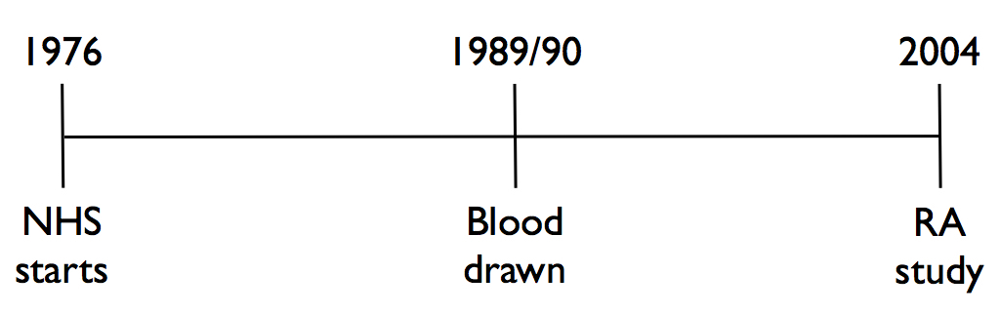
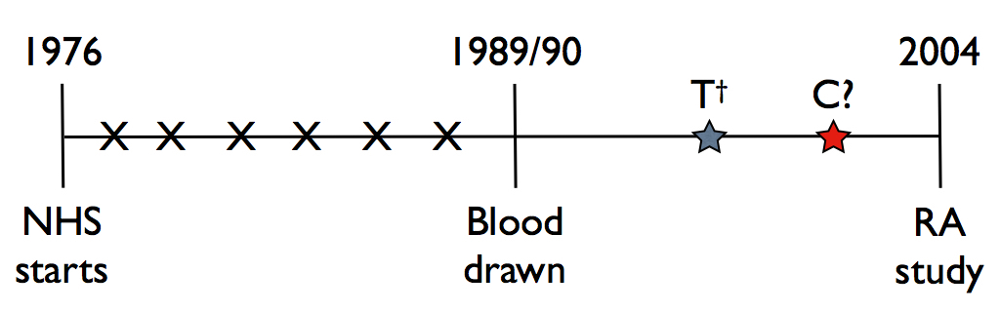

## Contents

1) Study Design and Challenges
    a. Sampling
    b. Time-varying effects
    c. Evaluation
2) Model Construction
    a. Sampling
    b. Time-varying effects
3) Evaluation
4) Simulation

## Study Design

- 121,700 US female registered nurses aged 30-55 enrolled in 1976
- 32,826 contributed blood
- 146 contracted RA between 1989/90 and 2004

## Study Design

- 126 RA patients had blood drawn in 1989/90 (cases)
- 337 controls matched on clinical/bloodwork covariates (subcohort 1)
- 122 cases and 123 controls (randomly sampled from 337) had blood genotyped in 2004 (subcohort 2)

## Study Design

- $T^\dagger$ indicates time from blood draw to disease onset
- Data from prior to 1989 not used
- $C$ is right-censored time, unclear if always 2004 or not

## Study Design: Covariates Collected

- Clinical covariates (taken at time of blood draw): $\textbf{Z}$
    - Age
    - Smoking (in pack-years)
    - Alcohol (cumulative intake)
- Blood sample biomarkers (regarding inflammation): $\textbf{B}$
    - IL-6
    - sTNFRII
- Genetic data: $\textbf{G}$
    - 39 SNPs identified with RA risks

## Study Design

Question: 

How can we identify the relevant risk factors in this study design, accounting for the fact that the effects of some covariates may change over time?

## Challenges: Sampling

- The control group not a simple random sample, due to matching
- Subcohort 2 is nested within subcohort 1
- Further difficulties due to protection of some individuals

## Challenges: Time-varying effects

- Certain biomarkers have strong correlation at short-term predictions, but not long-term predictions
    - Most survival models ignore this and consider biomarkers time-invariant
- Also, there are a large number of covariates relative to the subcohort size

## Challenges: Evaluation

- ROC method not available for study designs that are all of the following:
    - Multi-phase
    - Time-dependent
    - Multivariate
    - Accounting for outcome-dependent sampling
- Need incremental value (IncV) metric for models with and without markers of interest
    - Didn't exist for 3-phase studies
    - Sequential finite population sampling induces complex correlation between observations
    
## Model Construction: Sampling

In the last two classes, we learned about inclusion probabilities and inverse probability weighting (IPW) for nested case-control studies, providing us with the following equations (notation changed to fit our paper):

$$
\begin{aligned}
\hat{p}_{0i} =& 1 - \prod_{j:i \in R_j} (1 - \frac{m}{\mathfrak{n}_j - 1}\delta_j) \\
\hat{p}_i =& \delta_i + (1-\delta_i)\hat{p}_{0i} \\
\hat{w}_i =& V_i/\hat{p}_i
\end{aligned}
$$

- $\hat{p}_{0i}$ is the probability that subject $i$ is chosen as a control for any subject $j$. $m$ is number of samples, $\mathfrak{n}_j$ is size of risk set $R_j$.
- $\hat{p}_i$ is the probability of being chosen as a case, $\delta_i$, or as a control, $(1-\delta_i)\hat{p}_{0i}$.
- $\hat{w}_i$ is the weight for the contribution of each observation to the likelihood, with $V_i$ as the selection indicator weighted by the inverse of the probability of selection.

## Model Construction: Sampling

These equations need to be adjusted for each subcohort (denoted with superscript $\mathbb{B}$ and $\mathbb{G}$), like so:

$$
\begin{aligned}
\hat{p}_{0i}^{\mathbb{B}} =& 1 - \prod_{j:i \in R_j} (1 - \frac{m^{\mathbb{B}}\delta_j}{\mathfrak{n}_j - 1}) \\
\hat{p}_{0i}^{\mathbb{G}} =& 1 - \prod_{j:i \in R_j} (1 - \frac{m^{\mathbb{B}}\delta_j}{\mathfrak{n}_j - 1}\cdot \frac{m^\mathbb{G}}{m^\mathbb{B}}) \\
=& 1 - \prod_{j:i \in R_j} (1 - \frac{m^{\mathbb{G}}\delta_j}{\mathfrak{n}_j - 1}) \\
\hat{p}_i^\mathbb{B} =& \delta_i + (1-\delta_i)\hat{p}_{0i}^\mathbb{B} \\
\hat{p}_i^\mathbb{G} =& \delta_i + (1-\delta_i)\hat{p}_{0i}^\mathbb{G}
\end{aligned}
$$

## Model Construction: Sampling

Since some portion of the sample is protected for use in other studies ($1-\mathbb{P}_0$), that also needs to be accounted for:

$$
\begin{aligned}
\mathbb{P}_i^\mathbb{B} =& \hat{p}_i^\mathbb{B}\mathbb{P}_0 \\
\mathbb{P}_i^\mathbb{G} =& \hat{p}_i^\mathbb{G}\mathbb{P}_0 \\
\hat{w}_i^\mathbb{B} =& V_i^\mathbb{B}/\hat{p}_i^\mathbb{B} \\
\hat{w}_i^\mathbb{G} =& V_i^\mathbb{G}/\hat{p}_i^\mathbb{G}
\end{aligned}
$$

## Model Construction: Time-varying effects

A commonly used approach is the Proportional Hazards model from survival analysis:

$$
\begin{aligned}
P(T^{\dagger}\le t_0|\boldsymbol{Z}_{\mathbb{G} + \mathbb{B}}) =& 1 - exp [exp\{\boldsymbol{\gamma}^{COX}_{\mathbb{G} + \mathbb{B}}(t_0)^T\boldsymbol{Z}_{\mathbb{G} + \mathbb{B}}\}] \\
\boldsymbol{\gamma}^{COX}_{\mathbb{G} + \mathbb{B}} =& (log\Lambda_{\mathbb{G} + \mathbb{B}}(t_0), \boldsymbol{\beta}_{\mathbb{G} + \mathbb{B}}^T)^T
\end{aligned}
$$

- $\Lambda_{\mathbb{G} + \mathbb{B}}(t_0)$ is the baseline cumulative hazard function
- $\boldsymbol{\beta}_{\mathbb{G} + \mathbb{B}}$ are the unknown log hazard ratio parametes (i.e. marker effect size)
    - PH does not allow these marker effects to change over time

## Model Construction: Time-varying effects

Authors accounted for time-varying effects by using a GLM specified as:

$$
\begin{aligned}
P(T^{\dagger}\le t_0|\boldsymbol{Z}_{\mathbb{G} + \mathbb{B}}) =& g\{\boldsymbol{\gamma}^{GLM}_{\mathbb{G} + \mathbb{B}}(t_0)^T\boldsymbol{Z}_{\mathbb{G} + \mathbb{B}}\} \\
\boldsymbol{\gamma}^{GLM}_{\mathbb{G} + \mathbb{B}} =& (\alpha(t_0), \boldsymbol{\beta}_{\mathbb{G} + \mathbb{B}}(t_0)^T)^T
\end{aligned}
$$

## Model Construction: Time-varying effects

## Evaluation: Commonly-used accuracy measures for markers

$\mathbb{F}$ is the generic $t_0$-year risk estimate from fitting a model.

To evaluate the association of $t_0$-year RA risk with $\mathbb{F}$, the authors use the following accuracy measures: positive predictive value (PPV), negative predictive value (NPV), true positive rate (TPR), false positive rate (FPR), ROC  curve, and area under ROC curve (AUC).

$$
\begin{aligned}
PPV^{\mathbb{F}}_{t_0}(c) &= P(T^{\dagger}\le t_0| \mathbb{F}>c) \\
NPV^{\mathbb{F}}_{t_0}(c) &= P(T^{\dagger}> t_0| \mathbb{F}\le c) \\
TPR^{\mathbb{F}}_{t_0}(c) &= P(\mathbb{F}>c |T^{\dagger}\le t_0 ) \\
FPR^{\mathbb{F}}_{t_0}(c) &= P(\mathbb{F}>c |T^{\dagger}> t_0 ) \\
ROC^{\mathbb{F}}_{t_0}(u) &= TPR^{\mathbb{F}}_{t_0}\{FPR^{\mathbb{F}^{-1}}_{t_0}(u)\} \\
AUC^{\mathbb{F}}_{t_0} &= \int_{0}^{1}ROC^{\mathbb{F}}_{t_0}(u)du
\end{aligned}
$$

## Commonly-used accuracy measures for markers

- The Incremental Value (IncV, $\mathbb{I}_{\mathbb{D}}$) of an accuracy measure ($\mathbb{D}$) for a risk model with new markers ($m_1$ with $\boldsymbol{B} + \boldsymbol{Z}$) on top of a risk model with existing markers ($m_2$ with $\boldsymbol{Z}$ only) can be quantified as:
$$
\mathbb{I}_{\mathbb{D}}^{m_1/m_2}=\mathbb{D}^{\mathbb{F}_{m_1}}-\mathbb{D}^{\mathbb{F}_{m_2}}
$$
where $\mathbb{F}_{m}$ denotes the risk score for model $m$ and $\mathbb{D}^{\mathbb{F}_{m}}$ denotes the accuracy of the risk score $\mathbb{F}_{m}$ for $m\in\{m_1,m_2\}$.

- For example, the IncV of $\boldsymbol{B} + \boldsymbol{G}$ on top of existing markers $\boldsymbol{Z}$ in $AUC$ is defined as:
$$
\mathbb{I}_{AUC}^{\boldsymbol{B}+\boldsymbol{G}/\boldsymbol{Z}} =AUC^{\mathbb{F}_{\boldsymbol{B}+\boldsymbol{G}}}-AUC^{\mathbb{F}_{\boldsymbol{Z}}}
$$

## Estimation and Inference Procedure for Prediction Accuracy and IncV

DIPW estimators are used to account for the additional complexity due to three-phase sampling and multiple markers.

The IncV $\mathbb{I}_{AUC}^{m_1/m_2}$ can be estimated by
$$
\hat{\mathbb{I}}_{AUC}^{m_1/m_2}= \widehat{AUC}^{\hat{\mathbb{F}}_{m_1}}(c)-\widehat{AUC}^{\hat{\mathbb{F}}_{m_1}}(c),
$$
where
$$
\widehat{AUC}^{\hat{\mathbb{F}}_{m}}(c)=\frac{\sum_{i=1}^{n}\sum_{j=1}^{n}\hat{\omega}_i^m\hat{\bar{\omega}}_{t_0i}^{C}\hat{\omega}_j^m\hat{\bar{\omega}}_{t_0j}^{C}I\{\hat{\mathbb{F}}_{m_i}>\hat{\mathbb{F}}_{m_j},T_i\le t_0,T_j>t_0\}}{\sum_{i=1}^{n}\sum_{j=1}^{n}\hat{\omega}_i^m\hat{\bar{\omega}}_{t_0i}^{C}\hat{\omega}_j^m\hat{\bar{\omega}}_{t_0j}^{C}I\{T_i\le t_0,T_j>t_0\}}
$$
for $m\in \{m_1,m_2\}$, and $\hat{\omega}_i^{m}=\hat{\omega}_i^{\mathbb{G}}$ for models that include $\boldsymbol{G}$, $\hat{\omega}_i^{m}=\hat{\omega}_i^{\mathbb{B}}$ for models that involve $\boldsymbol{B}$ not $\boldsymbol{G}$, $\hat{\omega}_i^{m}=1$ for models that involve only $\boldsymbol{Z}$.

## Evaluation: RA Risk Model accuracy

The clinical models have very low discriminatory capacity:

  Data Used                                   Risk time     AUC     $95\%$ LB       $95\%$ UB
----------------------------------------     ----------    -----  -------------   -------------
$\boldsymbol{Z}$                               5-year       0.53           0.42            0.64
$\boldsymbol{Z}$                               15-year      0.58           0.53            0.63
$\boldsymbol{Z}_{\mathbb{G}+\mathbb{B}}$       5-year       0.70           0.62            0.79
$\boldsymbol{Z}_{\mathbb{G}+\mathbb{B}}$       15-year      0.62           0.55            0.69

Point estimates and confidence intervals determined by bootstrap.
<!-- - $AUC$ of time-specific GLMs with $\boldsymbol{Z}$ is 0.53 ($95\%$ CI: [0.42, 0.64]) for predicting 5-year RA risk -->

<!-- - $AUC$ of time-specific GLMs with $\boldsymbol{Z}$ is 0.58 ($95\%$ CI: [0.53, 0.63]) for predicting 15-year RA risk -->

<!-- - $AUC$ of time-specific GLMs with $\boldsymbol{Z}_{\mathbb{G}+\mathbb{B}}$ is 0.70 ($95\%$ CI: [0.62, 0.79]) for predicting 5-year RA risk -->

<!-- - $AUC$ of time-specific GLMs with $\boldsymbol{Z}_{\mathbb{G}+\mathbb{B}}$ is 0.62 ($95\%$ CI: [0.55, 0.69]) for predicting 15-year RA risk -->

## Evaluation: Incremental value of $\boldsymbol{B}$ and $\boldsymbol{G}$ over $\boldsymbol{Z}$

<!-- Add $\boldsymbol{B}$ and $\boldsymbol{G}$ on top of $\boldsymbol{Z}$ with respect to $AUC_{t_0}, TPR_{t_0}, PPV_{t_0}$ and $NPV_{t_0}$ at the cutoff values to achieve $FPR_{t_0}=0.1$ for $t_0=5,6,8,10,12,14,15$  -->
<!-- Solid,dash lines represents time-specific GLMs and PH models respectively. -->

Estimates of IncV with respect to AUC and TPR across $t_0$. Solid and dashed lines represent time-specific GLMs and PH models, respectively. Using cutoff values to achieve $FPR_{t_0}=0.1$.

## Evaluation: Incremental value of $\boldsymbol{B}$ and $\boldsymbol{G}$ over $\boldsymbol{Z}$

Estimates of IncV with respect to PPV and NPV across $t_0$. Solid and dashed lines represent time-specific GLMs and PH models, respectively. Using cutoff values to achieve $FPR_{t_0}=0.1$.

## Simulation: Overview

The simulation studies mimic the NHS RA study design 

Aim:

- Examine the validity of the proposed inference procedures in a three-phase nested case control design

- Compare the time-specific GLMs with the PH models with regard to prediction accuracy in the presence of time-varying marker effects

## Simulation: Setup

- 3 markers: conventional ($Z$), biologial ($B$), and genetic ($G$)
$$
\begin{aligned}
\boldsymbol{Z}_{\mathbb{G}+\mathbb{B}}=&(Z,B,G)^T \\
Z\sim& N(0,1) \\
B=&Z+e_{B} \\
e_{B}\sim& N(0,1) \\
G\sim& Uniform[-4,0]
\end{aligned}
$$

- Survival time model: $T^{\dagger}|\boldsymbol{Z}_{\mathbb{G}+\mathbb{B}}$
$$
\log(T^{\dagger}-2)=2.5+\frac{1}{1.5}(\epsilon_T-0.5Z-0.5B)/(2-G),
$$
where $\epsilon_T$ follows a standard extreme value distribution.
$$
P(T^{\dagger}\le t|Z,B,G)=1-\exp[-\exp\{\alpha(t)+0.5Z+0.5B+\beta_G(t)G\}]
$$
where
$$
\begin{aligned}
\alpha(t)=&3\{\log(t-2)-2.5\} \\
\beta_G(t)=&-1.5\{\log(t-2)-2.5\}
\end{aligned}
$$

## Simulation: Setup

- Assume $Z$ is available for the phase I full cohort, and $B$ is available for only the phase II $NCC^{\mathbb{B}}$ subcohort and $G$ is only available for the phase III $NCC^{\mathbb{G}}$ subcohort.

- In the construction of first subcohort, \textbf{three} controls are randomly selected from either the risk set without matching or risk set with matching on two variables ($\textbf{M}=(M_1,M_2)$). For the second subcohort, \textbf{one} control is randomly selected from the three controls selected from the first subcohort for each case.

- The sample size of the full cohort is 10,000 and 1,000 independent replicates

- Censoring mechanism: independent censoring with $C=\min\{C_1+9.5,C_2\}, C_1\sim Gamma(2,2), C_2\sim Uniform[5,15]$.

## Prediction models in simulation studies

Fit two full prediction models with all the markers, $\boldsymbol{Z}_{\mathbb{G}+\mathbb{B}}$

- Time specific GLM: $\mathbb{F}_{\mathbb{G}+\mathbb{B}}^{GLM}$:
$$
\begin{aligned}
P(T^{\dagger}\le t_0)=&g(\alpha(t_0)+\beta_Z(t_0)Z+\beta_{\mathbb{B}}(t_0)B+\beta_{\mathbb{G}}(t_0)G) \\
g(x)=&1-\exp(-\exp(x))
\end{aligned}
$$

- Cox PH Model: $\mathbb{F}_{\mathbb{G}+\mathbb{B}}^{COX}$:
$$
\lambda_{\boldsymbol{Z}_{\mathbb{G}+\mathbb{B}}}(t)=\lambda_{0}(t)\exp(\beta_ZZ+\beta_{\mathbb{B}}B+\beta_{\mathbb{G}}G)
$$

The prediction intervals $t_0=5,6,7,8,9,10$ are considered.

## Simulation: Regression coefficients

\begin{center}
\includegraphics{figures/figure4-1.pdf}
\end{center}

Average point estimates and $95\%$ empirical CIs of the regression coefficients for markers $Z$ and $B$ (this slide), and $G$ (next slide)

## Simulation: Regression coefficients

\begin{center}
\includegraphics{figures/figure4-2.pdf}
\end{center}

## Simulation:  Results-$AUC$ and IncV in $AUC$ 

\begin{center}
\includegraphics[width=0.5\textwidth]{figures/figure5a.jpg}
\includegraphics[width=0.5\textwidth]{figures/figure5b.jpg}
\end{center}

## Summary

- The approaches proposed in this paper are used to evaluate the IncV of new markers in risk prediction, incorporating the complex sampling schemes under a three-phase NCC design. The time-varying effect of markers on disease risk are also taken into account.

- The proposed inference procedures based on double inverse probability weighted (DIPW) estimators are robust to model misspecification.

- In both the real data analysis and simulation results, the ROC accuracy measures and predictive values of biomarkers suggest that DIPW-based estimation procedures improve on those of Cox's proportional hazard model, especially for short-term risk prediction.
