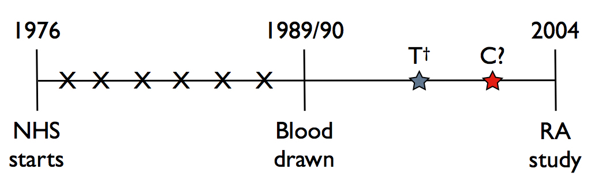

### Study Design

The paper ``Assessing Incremental Value of Biomarkers with Multi-Phase Nested Case-Control Studies'' developed a novel method for determining the impact of time-varying covariates in a unique study design.
As an example they attempted to determine the effects of specific biomarkers on the onset of rheumatoid arthritis (RA) from Nurses' Health Study data.

The study design for this experiment was a multi-phase nested case-control study.
121,700 US female registered nurses aged 30-55 enrolled for the Nurses' Health Study in 1976, of which 32,826 contributed blood in 1989 or 1990.
146 nurses contracted RA between 1989/90 and 2004, of which 126 RA patients had blood drawn in 1989/90 -- these are the case group for this study.
There were two subcohorts for this study.
The subcohort B consisted of 337 controls who were matched to the cases on clinical/bloodwork covariates.
Subcohort G consisted of 123 controls randomly sampled from the 337 in subcohort B and had their blood genotyped in 2004.

During the blood draw several clinical covariates and blood sample biomarkers were taken.
Clinical covariates ($\textbf{Z}$) included age, smoking (in pack-years), and alcohol (cumulative intake).
The blood sample biomarkers ($\textbf{B}$) were IL-6 and sTNFRII, which have shown correlation to inflammation in prior studies.
In 2004, the blood was genotyped to check for 39 SNPs identified with RA risks, this data is denoted as $\textbf{G}$.

The authors of the paper sought to identify the relevant risk factors in this study design, accounting for the fact that the effects of some covariates may change over time.
To do this, they had to resolve issues due to sampling, time-varying effects, and a lack of evaluation techniques for this specific study design.

### Sampling

This study design has a complex sampling structure that must be accounted for.
The control group not a simple random sample, due to matching with the cases. 
Subcohort G is nested within subcohort B, thus there is a sample within a sample.
A fraction of the individuals were unable to participate in this study as their blood protected for use in other cancer-related experiments.

In the last two classes, we learned about inclusion probabilities and inverse probability weighting (IPW) for nested case-control studies, providing us with the following equations (notation changed to fit this paper):

$$
\begin{aligned}
\widehat{p}_{0i} =& 1 - \prod_{j:i \in R_j} (1 - \frac{m}{\mathfrak{n}_j - 1}\delta_j) \\
\widehat{p}_i =& \delta_i + (1-\delta_i)\widehat{p}_{0i} \\
\widehat{w}_i =& V_i/\widehat{p}_i
\end{aligned}
$$

where $\widehat{p}_{0i}$ is the probability that subject $i$ is chosen as a control for any subject $j$, $m$ is number of samples, and $\mathfrak{n}_j$ is size of risk set $R_j$.
$\widehat{p}_i$ is the probability of being chosen as a case, $\delta_i$, or as a control, $(1-\delta_i)\widehat{p}_{0i}$.
$\widehat{w}_i$ is the weight for the contribution of each observation to the likelihood, with $V_i$ as the selection indicator weighted by the inverse of the probability of selection.

These equations need to be adjusted for each subcohort (denoted with superscript $\mathbb{B}$ and $\mathbb{G}$), like so:

$$
\begin{aligned}
\widehat{p}_{0i}^{\mathbb{B}} =& 1 - \prod_{j:i \in R_j} (1 - \frac{m^{\mathbb{B}}\delta_j}{\mathfrak{n}_j - 1}) \\
\widehat{p}_{0i}^{\mathbb{G}} =& 1 - \prod_{j:i \in R_j} (1 - \frac{m^{\mathbb{B}}\delta_j}{\mathfrak{n}_j - 1}\cdot \frac{m^\mathbb{G}}{m^\mathbb{B}}) \\
=& 1 - \prod_{j:i \in R_j} (1 - \frac{m^{\mathbb{G}}\delta_j}{\mathfrak{n}_j - 1}) \\
\widehat{p}_i^\mathbb{B} =& \delta_i + (1-\delta_i)\widehat{p}_{0i}^\mathbb{B} \\
\widehat{p}_i^\mathbb{G} =& \delta_i + (1-\delta_i)\widehat{p}_{0i}^\mathbb{G}
\end{aligned}
$$

Since some portion of the sample is protected for use in other studies ($1-\mathbb{P}_0$), that also needs to be accounted for.

$$
\begin{aligned}
\mathbb{P}_i^\mathbb{B} =& \widehat{p}_i^\mathbb{B}\mathbb{P}_0 \\
\mathbb{P}_i^\mathbb{G} =& \widehat{p}_i^\mathbb{G}\mathbb{P}_0 \\
\widehat{w}_i^\mathbb{B} =& V_i^\mathbb{B}/\widehat{p}_i^\mathbb{B} \\
\widehat{w}_i^\mathbb{G} =& V_i^\mathbb{G}/\widehat{p}_i^\mathbb{G}
\end{aligned}
$$

where $\widehat{w}_i^\mathbb{B}$ is the weight for subject $i$ in a model for subcohort $\mathbb{B}$. 
$\widehat{w}_i^\mathbb{G}$ is the weight for subject $i$ in a model for subcohort $\mathbb{G}$, with effects from both $\textbf{B}$ and $\textbf{G}$.

### Time-varying effects

How a biomarker's association with an outcome changes over time is an overlooked topic in risk modeling.
Certain biomarkers have strong correlation at short-term predictions, but not long-term predictions.
Despite this, most survival models ignore this and consider biomarkers time-invariant.

A commonly used approach is Cox's Proportional Hazards (PH) model from survival analysis:

$$
\begin{aligned}
P(T^{\dagger}\le t_0|\boldsymbol{Z}_{\mathbb{G} + \mathbb{B}}) =& 1 - exp [-exp\{\boldsymbol{\gamma}^{COX}_{\mathbb{G} + \mathbb{B}}(t_0)^T\boldsymbol{Z}_{\mathbb{G} + \mathbb{B}}\}] \\
\boldsymbol{\gamma}^{COX}_{\mathbb{G} + \mathbb{B}} =& (log\Lambda_{\mathbb{G} + \mathbb{B}}(t_0), \boldsymbol{\beta}_{\mathbb{G} + \mathbb{B}}^T)^T
\end{aligned}
$$

where $\Lambda_{\mathbb{G} + \mathbb{B}}(t_0)$ is the baseline cumulative hazard function and $\boldsymbol{\beta}_{\mathbb{G} + \mathbb{B}}$ are the unknown log hazard ratio parameters (i.e. marker effect size).
The PH model does not allow these biomarker effects to change over time.

The authors accounted for time-varying effects by using a generalized linear model (GLM) specified as:

$$
\begin{aligned}
P(T^{\dagger}\le t_0|\boldsymbol{Z}_{\mathbb{G} + \mathbb{B}}) =& g\{\boldsymbol{\gamma}^{GLM}_{\mathbb{G} + \mathbb{B}}(t_0)^T\boldsymbol{Z}_{\mathbb{G} + \mathbb{B}}\} \\
\boldsymbol{\gamma}^{GLM}_{\mathbb{G} + \mathbb{B}} =& (\alpha(t_0), \boldsymbol{\beta}_{\mathbb{G} + \mathbb{B}}(t_0)^T)^T
\end{aligned}
$$

To estimate these parameters, the authors used the following estimating equation:

$$
\sum_{i=1}^n \overbrace{\widehat{w}_i^\mathbb{G}}^{\substack{\text{IPW} \\ \text{weights}}}
\underbrace{\widehat{\bar{\omega}}^C_{t_0i}}_?
\overbrace{\textbf{Z}_{\mathbb{G}+\mathbb{B}i}}^{\text{data for }i}
\underbrace{[I(T_i \le t_0) - g\{\boldsymbol{\gamma}^{GLM}_{\mathbb{G}+\mathbb{B}}(t_0)^T \textbf{Z}_{\mathbb{G}+\mathbb{B}i}\}]}_{\text{model error for } i \text{ at time } t_0} = 0
$$

The IPW weights are specified above in Sampling.
The data and model error are similar to what we've seen in least squares regression (e.g. $X^T(y-X\beta)=0=>\beta=(X^TX)^{-1}X^Ty$).
However $\widehat{\bar{\omega}}^C_{t_0i}$ is a novel parameter.

The original IPW weights account for the outcome-dependent sampling design.
However, they do not account for the fact that the censoring status of our observations may depend on $t_0$ or some of the covariates.
The authors used a double-IPW (DIPW) method to account for this in the likelihood estimation.

$$
\begin{aligned}
\widehat{\bar{\omega}}^C_{t_0i} =& \frac{\delta_i I(T_i \le t_0)} {\widehat{\mathcal{G}}_{\textbf{Z}_{C_i}}^{C}(T_i)} + \frac{I(T_i > t_0)} {\widehat{\mathcal{G}}_{\textbf{Z}_{C_i}}^{C}(t_0)} \\
\mathcal{G}_{\textbf{Z}_{C}}^{C}(t) =& P(C \ge t|\textbf{Z}_\mathbb{C})
\end{aligned}
$$

The first term in the formula for $\widehat{\bar{\omega}}^C_{t_0i}$ adjusts instances where selected times occur after disease diagnosis for a case ($\delta_i I(T_i \le t_0)$) and accounts for the probability that censoring might have happened at some point since disease diagnosis ($\widehat{\mathcal{G}}_{\textbf{Z}_{C_i}}^{C}(T_i)$).
The second term adjusts cases or controls that have not yet been censored ($I(T_i > t_0)$) and accounts for the probability that they could be censored sometime in the future\ ($\widehat{\mathcal{G}}_{\textbf{Z}_{C_i}}^{C}(t_0)$).
Both of these adjustment factors are allowed to depend on the data, i.e. if there was a relationship between alcohol usage and loss-to-followup.

With the estimating equation laid out, the authors estimated the time-varying effects of each covariate against RA.
We've selected a few of their covariate figures in Figure \ref{fig:TVC}.
Alcohol has a negative effect on RA, which starts out low, but not significantly lower than 0 and increases, but becomes more significant over the long-run.
IL6 is a strong, short-term indicator of RA risk, however its risk decreases and becomes insignificant over time.
The Cox PH model merely shows that IL6 was an insignificant indicator of RA risk, which would have overlooked its usefulness in the short term.
Genetic risk score (GRS) is significant throughout, but with a stronger effect in the short term, which would not have been picked up by the Cox PH model.

\begin{figure}[h]
\centering
\includegraphics[width=0.3\maxwidth]{figures/alcohol-plot}
\includegraphics[width=0.3\maxwidth]{figures/ils-plot}
\includegraphics[width=0.3\maxwidth]{figures/grs-plot}
\caption{The impact of alcohol, IL6, and genetic risk score on rheumatoid arthritis over time.}
\label{fig:TVC}
\end{figure}

